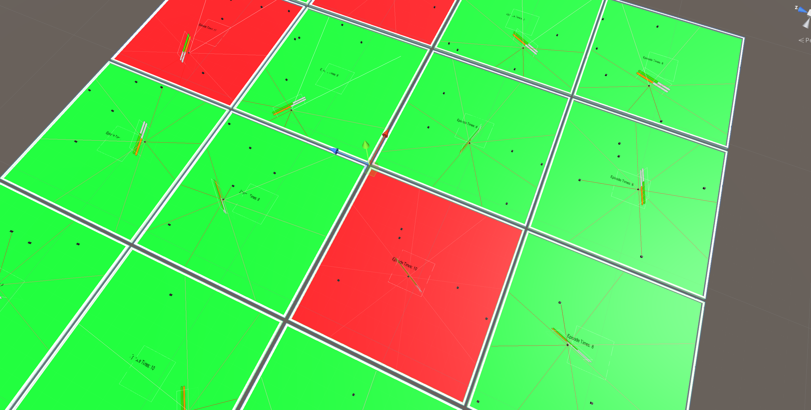
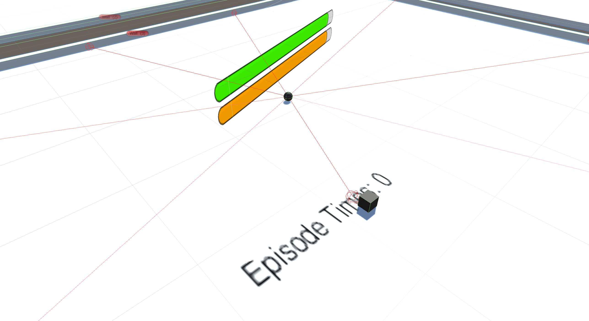
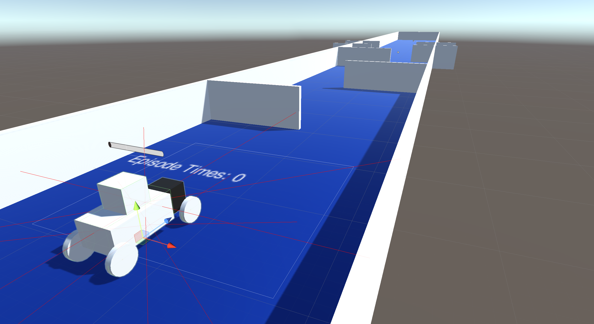

# RL-ROS-Domain

---

This is a project about reinforcement learning on Unity Agent and ROS. Here, I have provided some scenes for reference.

## Enviroment

---

| Component | Version      | Remark                                                              |
| --------- | ------------ | ------------------------------------------------------------------- |
| System    | Ubuntu 22.04 |                                                                     |
| Unity Hub | 2022.3.6f1   |                                                                     |
| Python    | 3.10.8       | 3.10.x                                                              |
| Pytorch   | 1.11.0+cu113 | For the CUDA                                                        |
| ml-agents | Release 20   | [Github Link](https://github.com/Unity-Technologies/ml-agents)         |
| CUDA      | 11.3         | [CUDA Link](https://developer.nvidia.com/cuda-11.3.0-download-archive) |
| ROS2      | Humble       |                                                                     |

## Demo

---

|   | Scene       | Image                                                     | Description                                                                                                                                                                                                                                                                                                                                              |
| - | ----------- | --------------------------------------------------------- | -------------------------------------------------------------------------------------------------------------------------------------------------------------------------------------------------------------------------------------------------------------------------------------------------------------------------------------------------------- |
| 1 | RollerAgent |   | This scenario describes an intelligent agent with "satiety" and "energy" attributes. The agent uses multiple rays to perceive its environment. The "satiety" decreases over time, and movement consumes "energy." Yet, if not hungry, the agent's "energy" replenishes gradually. The agent can also consume "Target" entities to restore its "satiety." |
| 2 | RoboticCar  |                               | In this scenario, you will have access to a vehicle equipped with the capability to perform various maneuvers such as moving forward and making turns. The objective is to train the vehicle to successfully accomplish specific tasks.                                                                                                                  |

## License

---

[Apache License 2.0](./LICENSE)
